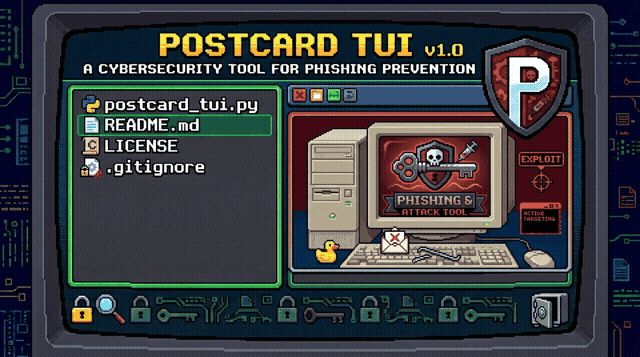

# PostcardTUI 



**Email spoofability auditing & live-fire proof toolkit** — audit a domain portfolio, rank the holes, prove exploitation with a controlled send, and hand the owner the exact DNS fix.

Owner-authorized security testing. Built for pentesters, MSPs, and domain owners who want evidence, not a PDF.  Please don't use this to victimize anyone or I will be pissed and probably ask my much more talented friends to pop your calc.

---

## Why not just use swaks?

[swaks](https://github.com/jetmore/swaks) is a superb **SMTP transport tool** — protocol negotiation, TLS, AUTH, pipelining, LMTP. It answers: *"does this SMTP transaction work?"*

PostcardTUI answers a different question: *"can someone impersonate this domain, how badly, and what's the fix?"*

| Capability | swaks | PostcardTUI |
|---|---|---|
| Crafted SMTP send | ✅ | ✅ |
| SPF / DMARC / DKIM record analysis | ❌ | ✅ |
| **False-confidence detection** (`+all`, `pct=0`, `sp≠p`, permerror risk) | ❌ | ✅ |
| Portfolio-scale bulk audit, ranked CRITICAL→OK | ❌ | ✅ |
| Interactive selection & wizard workflow | ❌ | ✅ |
| Dry-run `.eml` previews (send nothing) | ❌ | ✅ |
| Receiver-behavior calibration (Gmail vs Proton-class) | ❌ | ✅ |
| Placement intel: inbox-vs-spam factors | ❌ | ✅ |
| Verdict history & per-domain trends | ❌ | ✅ |
| Batch caps, randomized pacing, send logs | ❌ | ✅ |

They compose well: PostcardTUI tells you *whether and why* a send will land; swaks gives you protocol-level knobs for edge-case transport testing. Use both.

## The headline feature nobody else has

Most tools check *"do SPF/DMARC records exist?"* That lies. These **false-confidence combos** make a `p=reject` domain substantively defenseless while naive tools score it "protected":

- **SPF ending `+all`** (or missing `all` entirely — RFC 7208 says that's implicit `+all`) → *every IP on the internet passes SPF*, alignment succeeds, **DMARC passes the attacker's mail**. The policy doesn't just fail to block — it authenticates the attack.
- **`pct=0`** → zero failures enforced, 100% delivered. The policy is decorative.
- **`sp=` weaker than `p=`** → attackers invent subdomains precisely to inherit the forgotten tag.
- **>10 SPF DNS lookups** → permerror per RFC 7208 §4.6.4; DMARC's SPF leg silently stops counting.
- **Two SPF TXT records** → permerror, not "redundancy".

PostcardTUI flags these as **HIGH — policy VOIDED**, the "technically protected, substantively defenseless" class.

*(RFC 9989 note: `pct` was removed from DMARCbis in May 2026 and replaced by the binary `t` flag; legacy records carrying `pct` are ambiguous by definition. `np=` is the new cheapest whole-subdomain fix.)*

## Components

One script, zero dependencies (pure Python 3.10+ stdlib):

**`postcard_tui.py`** — the whole toolkit:
- **Interactive wizard**: audit → rank → select → compose → dry-run/send
- **Headless mode**: `--audit` / `--audit-file` with **exit code = worst severity (0–4)** — cron-friendly, CI-friendly
- Writes ranked reports (CSV + Markdown) and `spoofable.txt` (CRITICAL-only list)
- **DNS-existence aware (v2.1)**: NXDOMAIN domains are reported OK (nothing to lock down), SERVFAIL/resolver failures are reported as *unknown* — never a false CRITICAL; `spoofable.txt` and exit codes only reflect domains that verifiably exist
- Everything persists to `~/.postcard_config.json` via the Settings menu — no file editing

## Quick start

```bash
# Stage 1 — passive DNS audit. No mail sent. Safe on any domain you're authorized to assess.
python3 postcard_tui.py --audit "example.com example.org"        # exit code = worst severity
python3 postcard_tui.py --audit-file domains.txt

# or the interactive wizard (run on a host with outbound port 25 for Stage 2):
python3 postcard_tui.py
#   [1] Full audit  [2] Quick send  [3] Settings  [4] History  [5] Audit-only  [6] Trend
```

**Stage 2 (live-fire proof)** sends one crafted email per selected domain to a seed inbox **you control**. If it lands in the *inbox* (not spam), that domain's spoof defense has failed for real. Check `Authentication-Results` in "Show original": `spf=none dmarc=none` + delivered = vulnerability proven.

### Configuration

Everything persists to `~/.postcard_config.json` via the wizard's Settings menu — no file editing:

| Setting | Meaning |
|---|---|
| Test inbox | Recipient you control (seed inbox) |
| EHLO hostname | **Must match your VPS's rDNS/PTR** or you add a spam signal |
| X-Mailer | Boring desktop client string beats script-y defaults |
| Pacing | Random delay window between sends (default 8–20s) |
| Batch cap | Max emails per run (default 10) |
| Display-test domain | A real domain *you* control, for the display-name bypass demo |

### Receiver reality (measured, not folklore)

- **Gmail** hard-blocks unauthenticated senders (`550 5.7.26`) and 550s missing `Message-ID` — PostcardTUI sets Date/Message-ID/MIME-Version correctly so your test measures *DMARC policy*, not RFC 5322 hygiene.
- **Proton-class providers deliver** recordless-domain spoofs — inbox or spam by content/IP reputation. That's where the real exposure lives.
- SMTP probing **cannot** verify tenant activeness on shared MXes; ask the domain owner before prescribing fixes.

## The fix (deliver this with every report)

```dns
; Domain sends no mail (dead/parked — the most common and most dangerous case):
@       TXT  "v=spf1 -all"
_dmarc  TXT  "v=DMARC1; p=reject; sp=reject"

; Domain sends mail (e.g. Google Workspace):
@       TXT  "v=spf1 include:_spf.google.com -all"
_dmarc  TXT  "v=DMARC1; p=quarantine; rua=mailto:dmarc@yourdomain"
; + DKIM at the provider, then escalate quarantine -> reject
; + M365: enable DKIM in Defender portal, add selector1/selector2 CNAMEs
```

Re-run the audit and one live send after the fix: the before/after (silent delivery → deterministic reject) is the whole argument.

## Responsible use — read this

See [ETHICS.md](ETHICS.md). Short version: **test only domains you own or are explicitly authorized to test**, send only to inboxes you control, keep volume low. Unauthorized spoofing is illegal in most jurisdictions (CFAA, Computer Misuse Act, and friends). The maintainers accept no liability for misuse.

## Related tools

- [swaks](https://github.com/jetmore/swaks) — SMTP transport Swiss Army knife (use it for protocol-level testing)
- [spoofcheck](https://github.com/BishopFox/spoofcheck) — classic single-domain checker (2017, unmaintained)
- [Spoofy](https://github.com/MattKeeley/Spoofy) — bulk audit ancestor
- [checkdmarc](https://github.com/domainaware/checkdmarc) — gold-standard SPF/DMARC parser library
- [parsedmarc](https://github.com/domainaware/parsedmarc) — DMARC report monitoring (defense side)

PostcardTUI's niche is the **full pipeline**: portfolio audit → false-confidence detection → interactive composition → live-fire proof → written fix. No other open-source tool combines all five.

## Docker

```
docker build -t postcardtui .

# passive DNS audit of any domain list (nothing sent, exit code = worst severity):
docker run --rm -v "$PWD":/data postcardtui --audit "domain1.com domain2.net"
docker run --rm -v "$PWD":/data postcardtui --audit-file /data/domains.txt

# interactive wizard (sends happen only after in-wizard review + confirm):
docker run --rm -it -v "$PWD":/data postcardtui
```

Reports, send-logs and history land in the mounted folder, not the image.
The container honors `POSTCARD_HOME` for config/history paths.

## License

MIT — see [LICENSE](LICENSE).
